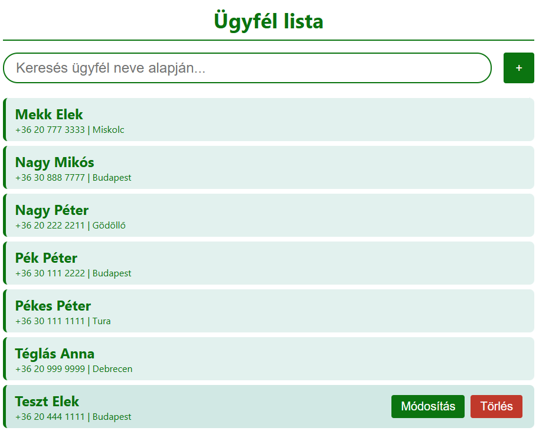
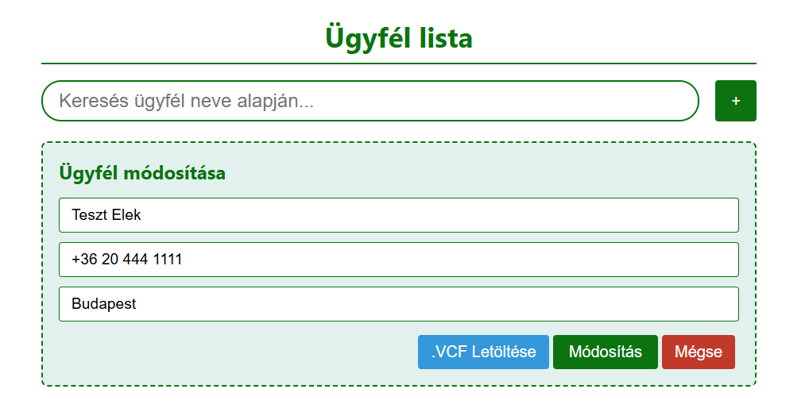

# Telefonkönyv Webalkalmazás (Full-Stack Phonebook App)

A program egy egyszerű telefonkönyv megvalósítása mind front end és backend téren.
A telefonkönyv egy listát tartalmaz az ügyfelekről. Ezt a listát lehet módosítani alapvető CRUD-módszerekkel.
Az ügyfélről mentett információk:
* **Teljes Név**
* **Telefonszám**
* **Lakhely** (város)

## Használt Technológiák
* **Frontend:** Vue.js, HTML, CSS, JavaScript, Axios
* **Backend:** Java 21, Spring Boot, Spring Data JPA, Hibernate
* **Adatbázis:** MySQL
* **Architektúra:** RESTful API

## Főbb Funkciók
* **Teljes körű CRUD műveletek:** Új ügyfelek rögzítése, meglévők szerkesztése, listázása és törlése.
* **Valós idejű keresés:** Dinamikus keresőmező, amely gépelés közben azonnal szűri a listát az ügyfelek neve alapján.
* **Adatvalidáció:** Csak előre megadott séma alapján lehet értékeket megadni, főleg telefonszám esetén.
* **vCard (.vcf) Exportálás:** Az ügyfelek adatai a módosítás fülön belül letölthetők, amelyek importálhatóak mobiltelefonokba.

## Képek
### Kép a listáról


### Kép a módosításról


---
# Futtatás

**Előfeltételek:** Java 21 telepítve a gépen.

## Adatbázis Beállítása (Kötelező lépés minden módszerhez!)

Mielőtt bármilyen módon elindítaná az alkalmazást, a számítógépen futnia kell egy MySQL szervernek.

1. Indítson el egy helyi MySQL szervert (pl. XAMPP, WAMP, vagy natív MySQL).
2. Nyissa meg a phpMyAdmin-t.
3. Hozzon létre egy teljesen üres adatbázist **`phonebook_db`** néven.
4. A táblákat (`contacts`) és a tesztadatokat a Spring Boot automatikusan létrehozza a legelső indításkor.

---

## 1. Opció: Egyszerű futtatás

Ha csak használni vagy tesztelni szeretné az alkalmazást fejlesztés nélkül, töltse le a kész csomagot a **Releases** fülről.

1. Töltse le a legújabb verziójú `.jar` fájlt a GitHub *Releases* szekciójából.
2. Nyisson meg egy parancssort (CMD vagy Terminál) abban a mappában, ahova letöltötte.
3. Futtassa a következő parancsot:
```bash   
java -jar phonebook-0.0.1-SNAPSHOT.jar
```
4. Nyissa meg a böngészőt, és navigáljon a `http://localhost:8080` címre.

## 2. Opció: Fejlesztői Környezet (Kódoláshoz és módosításhoz)

Ha szeretné módosítani a kódot, a Frontend-et és a Backend-et külön-külön kell futtatnia, hogy élvezhesse az élő frissítés (Hot-Reload) előnyeit.

### Backend (Spring Boot) indítása
1. Nyissa meg a projektet egy Java IDE-ben (pl. IntelliJ IDEA, VS Code, Eclipse).
2. Ellenőrizze az `application.properties` tartalmát.
3. Indítsa el a projektet az IDE-ből (vagy használja a `.\mvnw spring-boot:run` parancsot).
4. A szerver a `8080`-as porton indul el.

### Frontend (Vue.js) indítása
1. Nyisson egy új terminált, és lépjen be a `vue-project` mappába:
```bash
cd vue-project
```
2. Telepítse a szükséges csomagokat:
```bash
npm install
```
3. Indítsa el a fejlesztői szervert:
```bash
npm run dev
```
4. A valós idejű kinézet alapméretezett formáját a `5173`-as porton érheti el.
